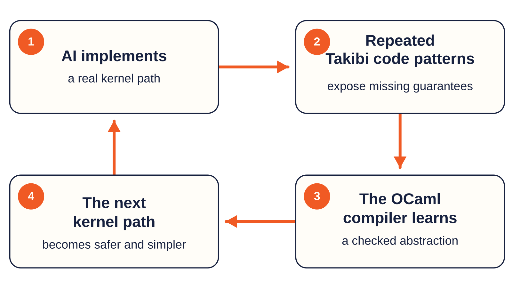

<!-- _class: lead -->
<!-- _paginate: false -->
<!-- _footer: "" -->

# Create your own programming language and OS using OCaml, LLVM, and Generative AI -- accessible to everyone

Kiwamu Okabe

[github.com/takibi-lang/takibi](https://github.com/takibi-lang/takibi)

---

# We love building operating systems

But the traditional implementation language is a problem:

```text
C language gives the kernel complete control
              +
C language gives the kernel almost no proof
              =
one bad access can corrupt the entire system
```

We wanted a language designed for the place where a crash is least recoverable.

> Could more kernel failures become compile-time errors?

---

<!-- _class: invert -->

# Why OCaml + LLVM + Generative AI?

| Ingredient | Role |
|---|---|
| **OCaml** | Make syntax and static semantics explicit and changeable |
| **LLVM** | Produce real native code without writing machine backends |
| **Generative AI** | Implement enough compiler and kernel code to test ideas end-to-end |

The LLVM project **officially** maintains [OCaml bindings](https://github.com/llvm/llvm-project/tree/main/llvm/bindings).

LLVM IR is still hard. AI made it easy.

---

# The setup, keeps the human on the loop

<style scoped>
img {
  display: block;
  margin: 0 auto;
}
</style>


---

<!-- _class: video-slide -->

# Demo

<video src="demo.mp4" autoplay muted loop controls></video>

---

<!-- _class: invert -->

# The kernel is the language-design workload

<style scoped>
img {
  display: block;
  margin: 0 auto;
}
</style>



---

# C technique: describe NIC state with booleans

```c
frame->valid = true;
frame->tx_in_flight = true;
frame->released = false;
```

The representation also permits contradictions:

```c
frame->valid && frame->released
frame->tx_in_flight && frame->available
```

Every caller must remember which combinations are legal.

The compiler sees only fields and integers.

---

# Takibi technique 1: the NIC is a capability state machine

```text
NetRxCanAcquire
  -> NetRxValidated[desc]
  -> NetRxReplyReady[desc]
  -> NetTxInFlight[desc]
  -> NetRxCanAcquire
```

```rust
fn net_transmit(reply: sink NetRxReplyReady[desc])
    -> NetTxInFlight[desc];

fn net_tx_complete(in_flight: sink NetTxInFlight[desc])
    -> NetRxCanAcquire !{may_block};
```

Each transition consumes the previous state with `sink`.

---

# Make invalid NIC states unrepresentable

The type checker prevents:

- releasing the same RX frame twice;
- transmitting before validation;
- reacquiring a descriptor before TX completes;
- forgetting to return an active descriptor to DMA.

```text
detect an invalid state later        C flags

make the invalid state impossible    Takibi types
```

The capability types add no new descriptor identity at runtime.

---

# C technique: return a pointer into an RX buffer

```c
uint8_t *packet = net_rx_frame(frame);

net_rx_release(frame);  /* DMA owns it again */

parse(packet);          /* use after release */
```

The pointer still looks valid.

Its type does not remember:

- the available length;
- the descriptor it came from;
- when ownership returned to DMA.

---

# Takibi technique 2: tie the slice to descriptor authority

```rust
fn net_rx_frame(frame: borrow NetRxValidated[desc])
    -> [u8; 1514..] @ desc;
```

The result carries two proofs:

```text
at least 1514 bytes are available
                  +
the slice is derived from descriptor desc
```

```rust
let packet = net_rx_frame(frame);
let ready = net_rx_release(frame);
parse(packet); // compile error
```

---

<!-- _class: invert -->

# A problem even the AI could not solve: STM32 UART

**AI:** "Serial output is lost while using the SD card."

It kept investigating symptoms.

**Human:**

> Our UART is polling, while the SD card uses DMA. ChibiOS/RT normally uses
> DMA and interrupts for both. What happens if we change UART to DMA + IRQ?

**AI:** Implemented it, tested it on the board -- **problem solved.**

---

<!-- _class: invert -->

# Another blind way: kernel printf debugging

**AI:** Added more and more kernel-side prints to infer userspace behavior.

**Human:**

> If we need to know what BusyBox does, why not read the BusyBox source?

**AI:** Read the actual userspace implementation -- **problem solved.**

```text
more observability is not always more understanding
```

The human changed the source of evidence, not the amount of logging.

---

# The one OCaml-side rough edge: DWARF

Takibi emits DWARF and supports source debugging through GDB.

LLVM's OCaml bindings still lack convenient APIs for:

- `dbg.value` locations for SSA and entry parameter values;
- `DISubrange` construction for natural fixed-array display.

Takibi currently works around those gaps with debug-only allocas,
volatile preservation stores, and GDB artificial arrays.

We would like to contribute these capabilities upstream.

Details: [Takibi's open DWARF issues](https://github.com/takibi-lang/takibi/issues?q=is%3Aissue%20is%3Aopen%20DWARF)

---

<!-- _class: lead -->
<!-- _paginate: false -->
<!-- _footer: "" -->

# OCaml + LLVM + Generative AI makes the stack accessible

I tried the experiment: [github.com/takibi-lang/takibi](https://github.com/takibi-lang/takibi)

Question today's architectural assumptions.

Design **your** language and **your** OS with OCaml.

Perhaps design the CPU too, with [Hardcaml](https://github.com/janestreet/hardcaml).

## OCaml makes ambitious systems experiments ordinary.
