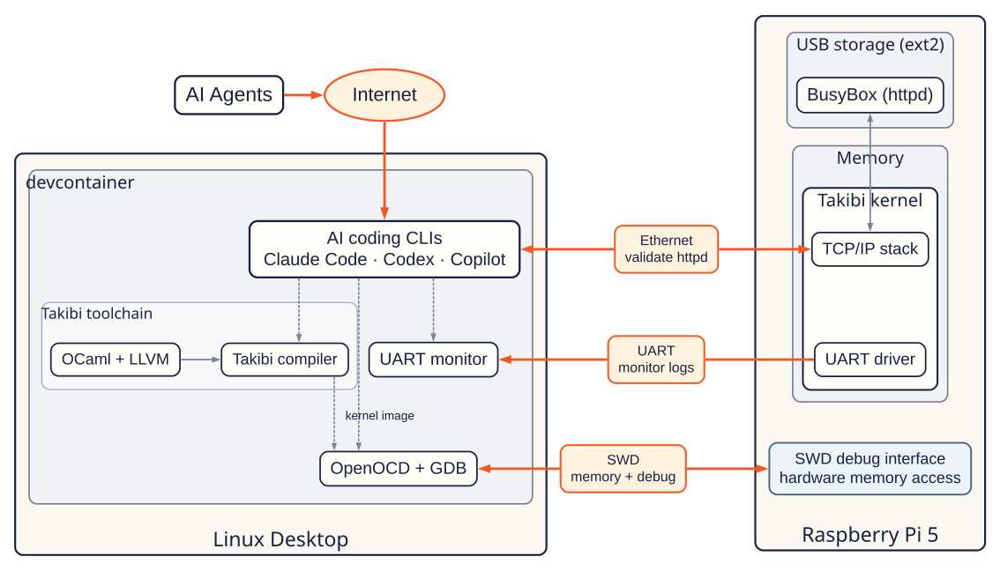
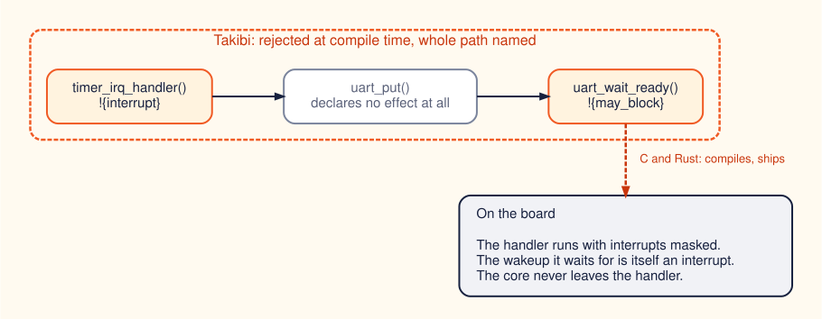
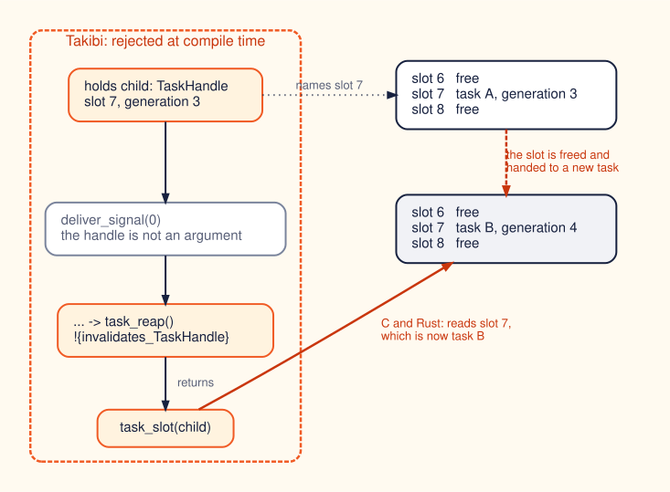
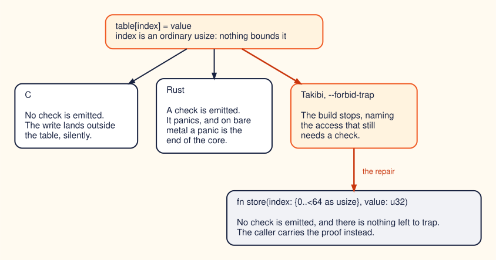

<!-- _class: lead -->
<!-- _paginate: false -->
<!-- _footer: "" -->

# Turning kernel defects into compile errors

## Building a language and a kernel at the same time

Kiwamu Okabe

[github.com/takibi-lang/takibi](https://github.com/takibi-lang/takibi)

---

# The kernel we rely on cannot be checked by its own language

```text
C gives the kernel complete control
             +
C gives the kernel almost no proof
             =
one bad access can corrupt the whole system, silently
```

A bad application access is contained by the kernel.

A bad kernel access happens inside the component responsible for that containment.

> Could more kernel failures be compile errors instead?

---

# Reimplementing the Linux interface is not new

| Implementation      | Linux ABI layer                       | What is underneath?            |
| ------------------- | ------------------------------------- | ------------------------------ |
| FreeBSD Linuxulator | **C**, kernel mode                    | FreeBSD kernel -- C            |
| gVisor Sentry       | **Go**, userspace                     | Linux kernel -- mostly C       |
| Fuchsia starnix     | **Rust**, userspace                   | Zircon -- C/C++                |
| Asterinas           | **safe Rust**, standalone kernel      | small `unsafe` Rust TCB (OSTD) |

The Linux interface is replaceable. These systems prove it.

Mature implementations were built in C, while newer memory-safe implementations
often still rely on a memory-unsafe host kernel. Clean-slate Rust kernels are now emerging.
Can we push safety further -- into the language and the kernel design itself?

---

# Build the language and the kernel together

A kernel cannot ask for a check its language does not have.

<style scoped>
img { display: block; margin: 0 auto; }
</style>



Generative AI is what makes this affordable. It is the method, not the point.

---

<!-- _class: video-slide -->

# It boots, and it runs BusyBox

<video src="assets/demo.mp4" poster="assets/demo.png" autoplay muted loop controls></video>

---

# Can you see the bug? (1/3)

```c
/* drivers/uart.c -- correct on its own */
void uart_putc(char c)
{
        wait_for_tx_ready();      /* may sleep */
        write_reg(UART_DR, c);
}
```

```c
/* drivers/timer.c -- correct on its own */
static irqreturn_t timer_isr(int irq, void *dev)
{
        uart_putc('.');
        return IRQ_HANDLED;
}
```

Neither file is wrong. The defect exists only in the combination.

---

# A blocking call inside an interrupt handler

<style scoped>
img { display: block; margin: 0 auto; }
</style>



```text
interrupt function 'timer_irq_handler' may block via
  timer_irq_handler -> uart_put -> uart_wait_ready
```

`uart_put` declares nothing, and is still named in the path.

---

# And this one? (2/3)

```c
/* a handle is a slot index and a generation, not a pointer */
static int report(struct task_handle child)
{
        deliver_signal();         /* ... -> wait4() -> release_task() */

        return task_slot(child);  /* the slot may hold a new task now */
}
```

Nothing here is handed `child`, and nothing here looks wrong.

A PID is the same idea with no generation at all: a bare number that gets
reused. Linux added `pidfd` to pin the identity instead -- **at runtime**.

---

# A handle that may name a destroyed object

<style scoped>
img { display: block; margin: 0 auto; }
</style>



---

# Dead at the call, not at the argument

```rust
fn task_reap(z: sink TaskZombie[id]) !{invalidates_TaskHandle} {}

fn signal_then_use(child: TaskHandle) -> usize {
    deliver_signal();
    return task_slot(child);
}
```

```text
'child' (TaskHandle) may name a destroyed object: 'deliver_signal' at line 16
(deliver_signal -> wait_and_reap -> task_reap) reaches a function marked
invalidates_TaskHandle, and no live witness vouches for this handle
```

Re-derive the handle, or hold a witness that keeps the object alive.

---

# And this? (3/3)

```c
static u32 table[64];

void store(size_t index, u32 value)
{
        table[index] = value;    /* index came from a packet header */
}
```

No call graph this time. The bug is the one line in the middle.

---

# An unproven index leaves a trap in the kernel

<style scoped>
img { display: block; margin: 0 auto; }
</style>



```text
Error: --forbid-trap: 1 runtime trap site(s) remain (listed above)
```

It ships no bounds-check trap because no access needed one.

---

<!-- _class: invert -->

# Rust's type system does not express these three

**Blocking call**: Rust has no general type-level effect for atomic context.
`klint` adds a MIR-based compile-time check outside the Rust type system.

**Stale handle**: `slotmap` and `generational-arena` encode a generation
in the key, but validate it **at lookup time**. Their copyable keys do not
encode per-object liveness in the type system.

**Unproven index**: Safe Rust prevents the memory error. A constant
out-of-range index is already a compile error; any other index is
bounds-checked, and the failure is a panic. A panic is a runtime error, and a
runtime error is the thing a kernel had no answer for in the first place.

---

# Why build a new language instead of using Rust

Rust for Linux is right, and it is working. But it inherits Rust's ceiling,
and nobody finds out what is above a ceiling by standing under it.

```text
a self-made language is a cheap scout:
nothing depends on it, so it may be broken and rebuilt
```

Every implementation on the earlier slide takes its language as given.
Designing the language alongside the kernel may reach compile-time guarantees
that applying an existing one cannot. That is the bet, and it is not settled.

If something found here later turns up in Rust or Zig, that is the best
ending this project could have.

---

<!-- _class: lead -->
<!-- _paginate: false -->
<!-- _footer: "" -->

# You do not have to believe me

Every program on these slides is in the repository, with the error it produces.

## [github.com/takibi-lang/takibi](https://github.com/takibi-lang/takibi) -- see `docs/wont-compile/`

Copy one, run your compiler, get the same message.

Questioning the assumptions under C and UNIX, with an AI as a co-worker,
turns out to be a great deal of fun.

---

<!-- _class: invert -->

# Appendix: does the catalog rot?

A page that transcribes a program and its error message is a claim with no
verifier, and a stale page renders exactly like a true one.

So the build checks it:

- `check_wont_compile_catalog.py` -- every entry names an Alcotest case that
  exists, and the index agrees with the entries.
- `buildcheck_wont_compile_samples.py` -- every program printed in the catalog
  goes through the compiler that build just produced. **8 must be rejected
  with the message beside them; 5 must be accepted.**

A regression does not make the documentation wrong. It makes the build red.
